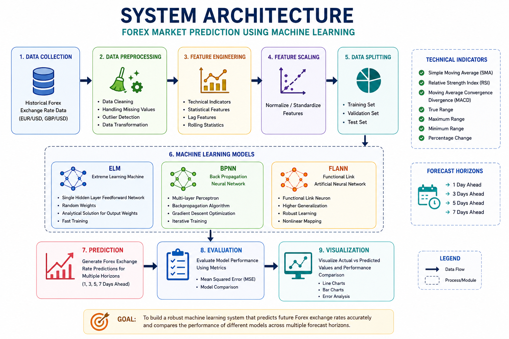
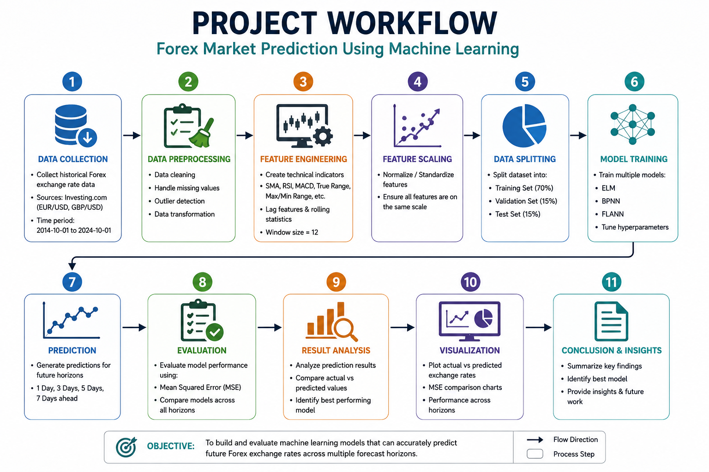
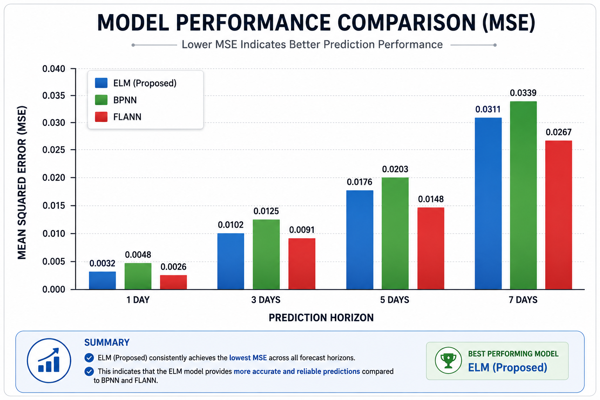
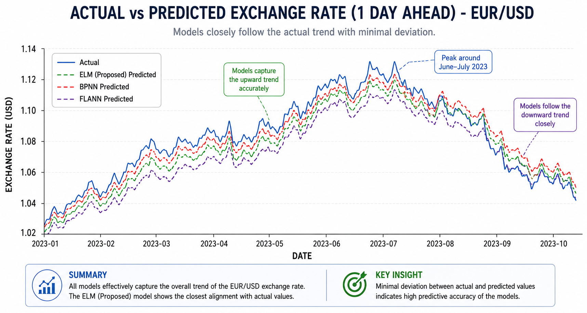

# 📈 Forex Market Prediction Using Machine Learning

<div align="center">


[](https://python.org)
[]()
[]()
[]()
[]()

*A Machine Learning-based predictive analytics system for forecasting Forex exchange rates using historical market data and technical indicators.*

</div>

---

# 📖 Overview

The foreign exchange (Forex) market is one of the largest and most dynamic financial markets in the world. Accurate forecasting of exchange rates can support better financial decision-making, risk management, and investment planning.

This project develops a machine learning-based predictive analytics framework to forecast future Forex exchange rates using historical market data. Multiple machine learning models are implemented and evaluated across different forecasting horizons to identify the most effective prediction approach.

The work includes data preprocessing, feature engineering, model training, performance evaluation, and visualization of prediction results.

---

# 🎯 Objectives

- Forecast future Forex exchange rates
- Analyze historical currency market data
- Perform feature engineering using technical indicators
- Train and compare multiple machine learning models
- Evaluate prediction performance using Mean Squared Error (MSE)
- Visualize forecasting accuracy

---

# 💹 Dataset

Historical Forex exchange rate datasets were used for:

- EUR/USD
- GBP/USD

The datasets include:

- Open Price
- High Price
- Low Price
- Closing Price
- Volume
- Percentage Change

---

# ⚙️ Technical Indicators

The following indicators were generated during feature engineering:

- Simple Moving Average (SMA)
- Relative Strength Index (RSI)
- Moving Average Convergence Divergence (MACD)
- True Range
- Maximum Range
- Minimum Range
- Percentage Change

---

# 🏗️ System Architecture

<p align="center">

</p>

The architecture consists of:

1. Data Collection
2. Data Preprocessing
3. Feature Engineering
4. Feature Scaling
5. Data Splitting
6. Machine Learning Models
7. Prediction
8. Evaluation
9. Visualization

---

# 🔄 Project Workflow

<p align="center">

</p>

The complete workflow begins with collecting historical exchange rate data, followed by preprocessing, feature engineering, model training, prediction, evaluation, and visualization.

---

# 🤖 Machine Learning Models

The following models were implemented and evaluated:

| Model | Description |
|--------|-------------|
| ELM | Extreme Learning Machine |
| BPNN | Back Propagation Neural Network |
| FLANN | Functional Link Artificial Neural Network |

---

# 📊 Performance Evaluation

Model performance was evaluated using **Mean Squared Error (MSE)**.

<p align="center">

</p>

Lower Mean Squared Error indicates better forecasting performance.

---

# 📈 Prediction Results

<p align="center">

</p>

The prediction graphs compare the actual exchange rate values with model predictions across multiple forecasting horizons.

---

# 🛠️ Technologies Used

| Category | Technologies |
|-----------|--------------|
| Programming | Python |
| Data Processing | Pandas, NumPy |
| Machine Learning | TensorFlow, Scikit-learn |
| Visualization | Matplotlib |
| Development | Google Colab, Jupyter Notebook |

---

# 📂 Repository Structure

```text
Forex-Market-Prediction-Using-Machine-Learning/
│
├── data/
├── docs/
│   ├── PROJECT.md
│   ├── ARCHITECTURE.md
│   └── ROADMAP.md
│
├── images/
│   ├── banner.png
│   ├── architecture.png
│   ├── workflow.png
│   ├── mse_comparison.png
│   └── prediction_results.png
│
├── notebooks/
│   └── Forex_Market_Prediction.ipynb
│
├── README.md
├── requirements.txt
├── LICENSE
└── .gitignore
```

---

# 🚀 Future Enhancements

- Deep Learning models (LSTM, GRU)
- Transformer-based forecasting
- Hyperparameter optimization
- Real-time Forex data integration
- Streamlit dashboard
- Cloud deployment
- Automated model retraining

---

# 📚 Documentation

Additional project documentation is available in the **docs** folder:

- PROJECT.md
- ARCHITECTURE.md
- ROADMAP.md

---

# 👨‍💻 Author

**Rahul Gadalay**

**Software Engineer @ TCS**

Data Engineering • Machine Learning • Predictive Analytics • AWS • Python • Generative AI

---

## ⭐ If you found this project useful, consider giving it a star!
